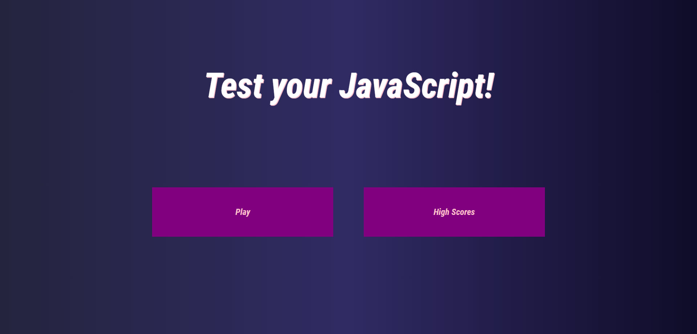
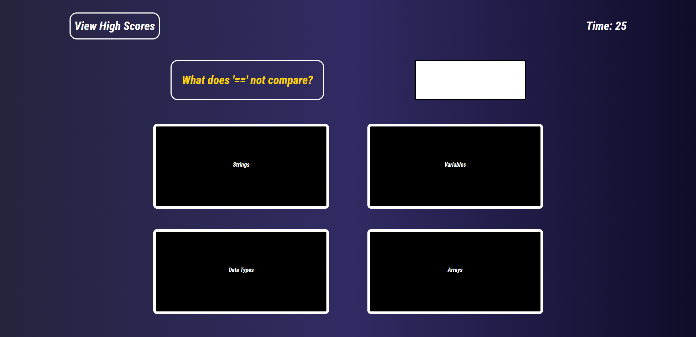
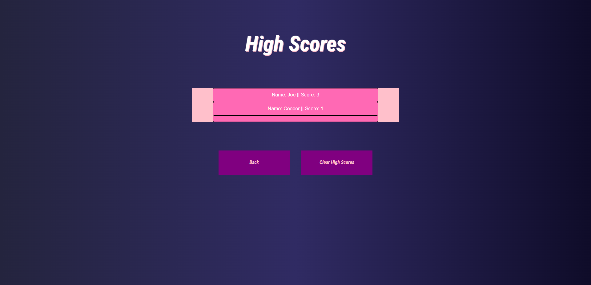

# test-your-js

[Test Your JavaScript](https://joerdixon.github.io/test-your-js/) is an interactive quiz complete with question pool and saved statistics.

## Description

This program is a quiz, testing the user on their knowledge of JavaScript.

On page load, the user will be presented with the option to either play through the quiz or see thier previous high scores (if any). 
The user will navigate the quiz in a repeated sequence of steps: A question will be shown with 4 possible answers for the user to select and a timer will begin. Once the user selects an a answer, they will be notified whether or not they were right and they will be presented with a button to present the next question When the user completes the quiz or the timer runs out, the user will be prompted to save their score. Once they do or manually navigate they will find the leaderboard where they can view their previously saved scores. The user will be able to return to the menu and play again.

## Examples

The Landing Page

The Quiz

The Leaderboard

Instalation

No package required, site hosted [here](https://joerdixon.github.io/test-your-js/)